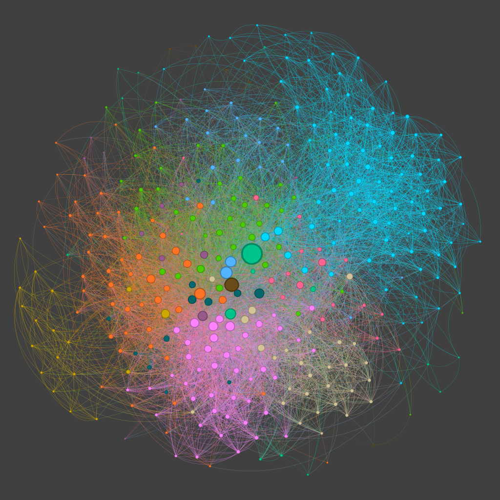

# Facebook friends grapher

Tool for visualizing Facebook friends graph.

Each node represents a friend and each edge represents 2 friends that are also mutual friends.

The node size represents the number of mutual friends.

The colors represent the communities of friends.

## Gather the data
https://www.databentobox.com/2019/07/28/facebook-friend-graph/

## Tune the graph
http://allthingsgraphed.com/2014/08/28/facebook-friends-network/
